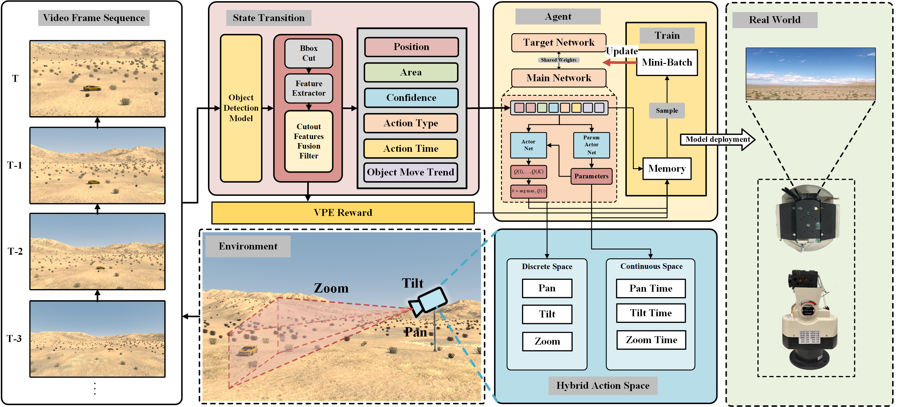
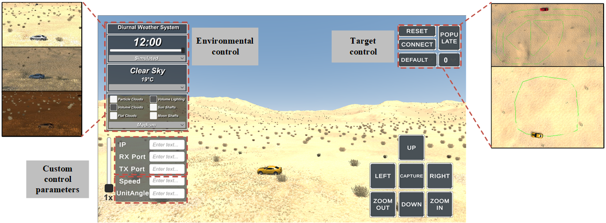

# Automatic Visual Enhancement of PTZ Camera Based on Reinforcement Learning

Information Countermeasure Technique Institute, Faculty of Computing, Harbin Institute of Technology

[//]: # (![DOI]&#40;https://img.shields.io/badge/DOI_10.3390%2Frs15205031-aa&#41;)
  

  
  
  
   

## CamSim

CamSim is a simulation environment designed for PTZ cameras based on the Unity3D engine, mainly aimed at solving the problems of high training costs and difficult scene reproduction of reinforcement learning in practical hardware platforms. The platform supports simulation control operations, parameter customization, dynamic environment change simulation, and other functions for detectors. It can communicate and interact with the algorithm end, providing a reliable experimental verification environment for the design, training, and performance evaluation of reinforcement learning algorithms.

CamSim is also open access and can be downloaded through the following link

链接: https://pan.baidu.com/s/1bCeLFE6pOdBZYzeLbbZrTw 提取码: 59ts

At present, only the Windows version is available, and other operating system versions will be updated in the future

Before you use it, please ensure that you have read our [Open Source License Terms](./term/Open Source License Terms.md).

## Dataset

The detection dataset of targets in the simulation environment can be obtained through the following link

链接: https://pan.baidu.com/s/1Jp9MT9pKVt6XguyHGACauw 提取码: u7id

## Usage and Model

Coming soon!

## Update

- [2024/01/19] The repo is created.
- [2024/12/20] The repo is updated.

## Acknowledgements 

We would like to express our gratitude to the following open-source projects that have significantly contributed to the development of this project: 

- [MMDetection](https://github.com/open-mmlab/mmdetection): A powerful open-source object detection toolbox. 

- [FastReID](https://github.com/JDAI-CV/fast-reid): A strong, simple, and fast baseline for person re-identification. 

  

  Their contributions have been invaluable in shaping the development of our work.

